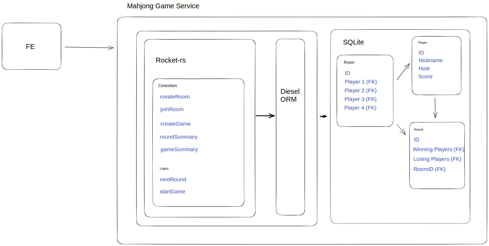

# Mahjong Game Service

- This is a microservice under the Mahjong Application

## Function

- Record game data
- Register player
- Create game room

## Tech Stack

- Rust
- Rocket
- Diesel (ORM)
- SQLite3
- Docker

## Service Sturcture

## Getting started

## Mahjong Calculator using Rust
Referencing the rules in [Baidu Wiki](https://baike.baidu.com/item/%E5%9B%BD%E9%99%85%E9%BA%BB%E5%B0%86%E8%A7%84%E5%88%99%E7%9A%84%E7%95%AA%E7%A7%8D/615857)
